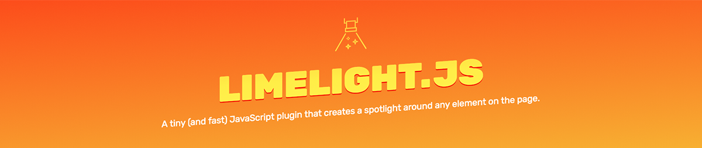

# Limelight ✨



A tiny (and fast) JavaScript plugin that creates a spotlight around any element on the page.

** Deprecated, kept for historical purposes. May revist in future. **

## Docs

### Installation

Import the module as you would any other ES6 module:

	import Limelight from 'limelight';

And include the CSS file (`dist/styles/style.css`) either through a `link` tag or as part of your build process.

### Setup/basic usage

In order to use Limelight, you'll need to have a 'wrapper' div around your site with `position: relative` set on it. This is the element Limelight will append its absolutely-positioned overlay to.

```html
<body>
  <!-- Wrapper div -->
  <div class="site-wrapper">
	<!-- Your site content. -->
  </div>
</body>
```

Set up a new instance by passing the target (i.e. the element you want to highlight) as the first argument to the class, and your global site wrapper as the second argument:

	const inst = new Limelight(
	  document.querySelector('.target-to-highlight')
	  document.querySelector('.site-wrapper'),
	);

Then you can open the instance with the `open` method:

	inst.open();

And change the target with `refocus`:

	inst.refocus(document.querySelector('.new-target'));

### Customisation/options

You can customise several options through [CSS custom properties](https://developer.mozilla.org/en-US/docs/Web/CSS/--*):

| Property | Description | Example |
|:--|:--|:--|
| --limelight-bg | The background colour of the overlay. | `rgba(0, 0, 0, 0.8)` |
| --limelight-overlay-transition-duration | The transition-duration of the overlay | `0.3s` |
| --limelight-window-transition-duration | The transition-duration on the windows (i.e. when the target changes). | `1s` |
| --limelight-z-index | The z-index of the overlay. | `999` |

These can be applied directly as an override on the `.limelight` CSS class. Alternatively they can be applied on creation as part of the `options` object.

## About

Most tooltip-tours include a blackout-style overlay that 'shines' a light on the target element. The problem is that it can be extremely hard to do that well. Traditionally you have two options:

- Add an overlay and promote the target's z-index. This is pretty good, but it relies on the target having a background, or it'll just be placed over the overlay. The element also has to have positioning for the z-index to even work (even if it's just relative, this can mess with stuff).
- Use an SVG mask. This works great, and was actually my first pass while creating this lib. However performance while animating (or even just repositioning) the mask was terrible in everything other than Blink, and Quantum doesn't event support transitions on mask transformations at all. Probably the best idea but not a great experience.
- Create 4 boxes that surround the target and transform them appropriately. A solid approach, but can get super complex if there are multiple targets to 'cut out' of the backdrop. Also you're positioning 4 boxes simultaneously.

However I saw a really neat implementation in [react-joyride](https://github.com/gilbarbara/react-joyride) that uses `mix-blend-mode`. Nothing is 'cut out' of the overlay, and the element still sits beneath it. However we can position a div on top of the area we want to make transparent, and use `hard-light` to give the appearance it's showing through.

### Caveats

- Absolutely positioned elements within the target (e.g. a tooltip) will not be visible, since we can't include them in the target calculations. This is where the z-index approach has us beat.
- There needs to be a site wrapper (just a div after `body` is fine) that has a `background-color`, even if it's just white. Otherwise there's nothing to blend with. Weirdly it doesn't always work just putting it on `body` directly.
- At this moment `border-radius` is not supported. This is due to the fact that the windows are just 1x1 boxes that are scaled up in order to meet the target dimensions. The solution here would be to [FLIP](https://aerotwist.com/blog/flip-your-animations/) the animations, meaning that the final width/height are properly applied. However even then the border-radius would be distorted pre/during the transition. I'm not convinced there's a great solution here.

### Cool stuff

- Auto-adjusts if the height of the target changes (or anything else on the page). Uses a [MutationObserver](https://developer.mozilla.org/en-US/docs/Web/API/MutationObserver) to respond to any changes to the DOM.
- Performant transitions between targets. Since we're just transforming a `div`, we don't suffer from the perf issues associated with an SVG mask.
